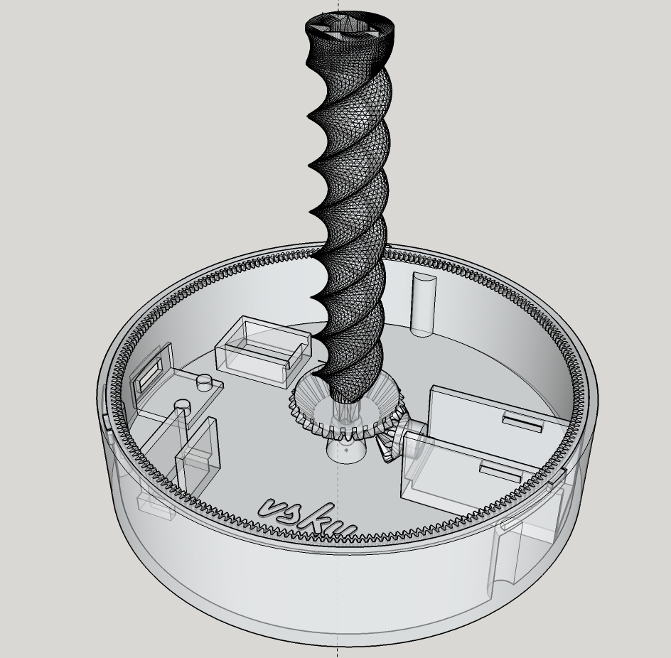
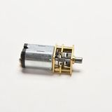
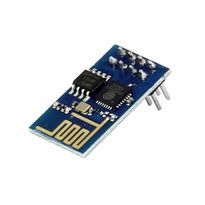
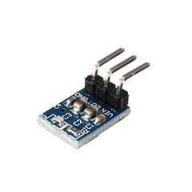
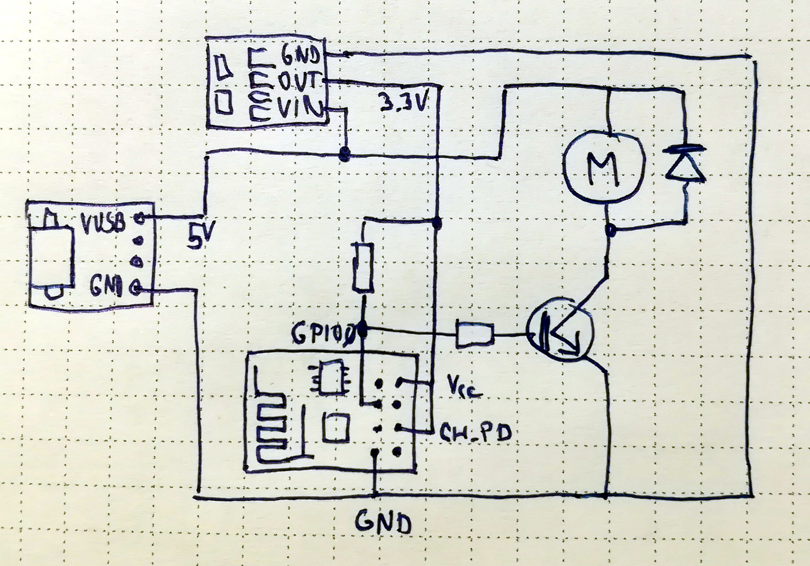
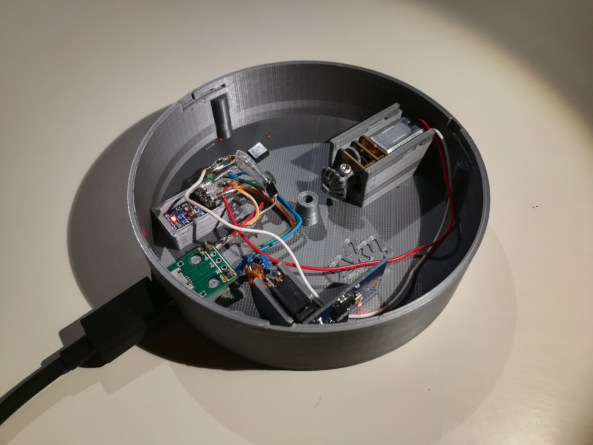

# Motorized version of the 3D Printed Marble Machine #3

## Intro
This is a motorized version of the 3D Printed Marble Machine #3. 
The model is also published on [thingiverse](https://www.thingiverse.com/thing:2555714) and this is the [original](https://www.thingiverse.com/thing:1385312) manual version.

It is 60% size of the original. If you have already one printed (in this size) it can be even upgraded to the motorized version by making a hole in the middle, changing the spiral and adding the base.

### Video

## Parts

STL models are in the folder [stl](./stl).

## Electronics
### Parts
* Motor 3-6V DC Small Micro Speed Reduction Geared Box Electric Motor 40RPM
* ESP8266 ESP-01
* MICRO USB to DIP Adapter 5pin female connector B type pcb converter
* 5V to 3.3V Step-Down Power Supply Module AMS1117-3.3 LDO 800MA
* Transistor BC548
* Resistor 10K (pull-up resistor) and 1K connected to the base of the transistor
* Diode 1N4004

### Scheme

## Programming

The main chip is ESP8266. I am using NodeMCU Lua ([https://github.com/nodemcu/nodemcu-firmware](https://github.com/nodemcu/nodemcu-firmware)) to program the ESP8266. The programming in Lua is very easy so the core program can have less than 120 lines including the web server used to adjust the clock.

A [NodeMCU custom builds](https://nodemcu-build.com/) tool can be used to compile the binary for ESP8266. Beside standard modules the following modules are used: `cron, enduser_setup, pwm, rtctime, sntp`. I have used the integer version of the firmware is used. Though float version should be fine too.

I am using [ESP8266 Flasher](https://github.com/nodemcu/nodemcu-flasher) to flash the binary.

To upload Lua files and files used by the web server the [ESPlorer](https://esp8266.ru/esplorer/) GUI can be used. These files are in the folder (lua_code)[./lua_code]).

The speed can be adjusted by PWM regulation. The power is supplied via micro USB so any phone adapter can be used.

The program connects to the WIFI, synchronizes time and runs the motor every 15 minutes for short period and for 5 seconds every hour between 7am and 11pm. Actually it also checks whether I am at home by pinging my phone. If this functionality is required the `net_info` module has to be included. It isavailable here: https://github.com/vsky279/nodemcu-firmware/tree/ping. It is not deployed in the `dev` version so it needs to be included manually and compiled locally.

ESP8266 exposes also a web server. It also exposes a telnet server so an OTA-like update of Lua codes can be performed.

## Assembly

The [ring](./stl/ring.stl) is used to lock the base to the track.
